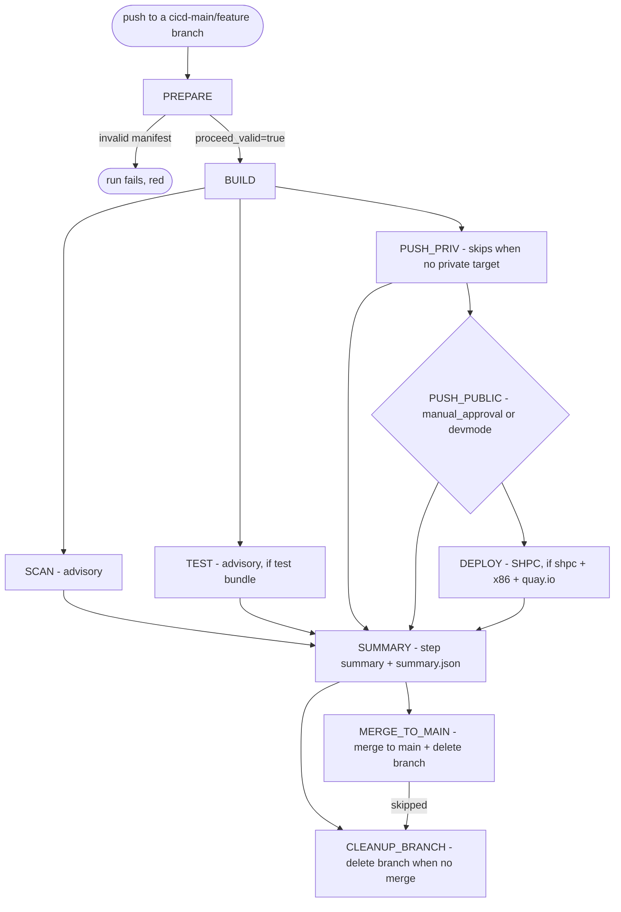

# ImageManagerAction — CI/CD pipeline

This workflow suite builds a container image from an uploaded Dockerfile, scans and
optionally tests it, publishes it to Pawsey registries + Acacia object storage, writes
an SHPC registry entry, and finally promotes the source branch into `main`. It is the
CI half of the ImageManager system: the ImageManagerWeb backend commits a Dockerfile +
`manifest.json` to a `cicd-<main>/<feature>` branch, and that push drives everything
below.

The entry point is [`ci-dispatch.yml`](ci-dispatch.yml), a thin dispatcher that wires
together the `reusable-*.yml` workflows. Each stage lives in its own reusable file so it
can be read, tested, and re-run in isolation.

## Trigger & concurrency

- **Trigger:** `push` to a branch matching `cicd-*` / `cicd-*/**`. The branch **must** be
  named `cicd-<main>/<feature>` (slash form). The dash form `cicd-main-feature` is *not*
  supported — PREPARE cross-checks the branch path against the manifest's `main/feature`,
  which a slashless name can never satisfy.
- **Concurrency:** grouped per branch (`${{ github.workflow }}-${{ github.ref }}`,
  `cancel-in-progress: true`). A newer push for the same branch cancels the in-flight run
  rather than racing on the runner cache / registry.

## Job graph

Arrows are simplified dependency edges — see each job's `needs:`/`if:` in
`ci-dispatch.yml` for the exact conditions. `PREPARE`, `SUMMARY`, `MERGE_TO_MAIN`, and
`CLEANUP_BRANCH` run on `ubuntu-latest`; `BUILD`/`SCAN`/`TEST`/`PUSH_*`/`DEPLOY` run on a
self-hosted runner (`[self-hosted, X64]` or `[self-hosted, ARM64]`, chosen by PREPARE
from the manifest `platform`).

### Stages

- **PREPARE** ([`reusable-prepare.yml`](reusable-prepare.yml)) — parses the branch name,
  locates `manifest.json` + the Dockerfile, and **validates the manifest**. Invalid input
  (missing `main`/`feature`/`version`, non-semver `version`, `platform` not `x86|arm`,
  branch path ≠ `main/feature`, or missing manifest/Dockerfile) emits a `::error`
  annotation and **fails the run** — there is no silent green no-op. It also computes
  registry-credential availability flags (`quayio_available`, `quayiosc_available`,
  `setonixreg_available`), picks the runner label, and runs the `process-template` action
  to generate the build matrix.
- **BUILD** ([`reusable-build.yml`](reusable-build.yml)) — one matrix job per variant.
  `podman build` with retry ([`.github/scripts/retry.sh`](../scripts/retry.sh)) under
  per-runner rootless isolation ([`process-template`](../actions/process-template) sets the
  variant, [`podman-env`](../actions/podman-env) sets `XDG_*`/`TMPDIR`). Templated `ARG`
  lines are rewritten from `matrix.values`. Saves a `docker-archive` **tar → Acacia**, then
  builds a **SIF → Acacia** (via [`setup-rclone`](../actions/setup-rclone)).
- **SCAN** ([`reusable-scan.yml`](reusable-scan.yml), **advisory**) — single pinned Trivy
  pass (`aquasecurity/trivy-action@v0.36.0`) over the tar. JSON → a human summary + a
  machine-readable `scan-counts.json`. Never gates downstream jobs. No SARIF upload, no
  `security-events` permission.
- **TEST** ([`reusable-test.yml`](reusable-test.yml), **advisory**) — only scheduled when a
  test bundle (`tests/entrypoint-tests.sh`) was committed. Runs the bundle *inside* each
  built image, mounted read-only at `/opt/tests`. Report-only: a non-zero exit shows in the
  summary but never fails the run.
- **PUSH_PRIV** ([`reusable-push-priv.yml`](reusable-push-priv.yml)) — pushes to the
  Setonix **private** registry namespace (`private-targets[0]`). **Cleanly skipped** when
  `private-targets` is empty — an empty list is a valid public-only build, not an error.
- **PUSH_PUBLIC** ([`reusable-push-public.yml`](reusable-push-public.yml)) — gated by the
  `manual_approval` environment (human approval), **except** in `devmode`, where it routes
  to the unprotected `development` environment and proceeds without a gate. Pushes to the
  selected public targets: `quay.io/pawsey`, `quay.io/pawseysc`, and the Setonix public
  namespace. Runs even when PUSH_PRIV was *skipped* (status override), but is blocked if
  PUSH_PRIV *failed*.
- **DEPLOY** ([`reusable-deploy.yml`](reusable-deploy.yml)) — only when `shpc: true`,
  `platform: x86`, quay.io is a target, and quay.io creds exist. Fetches the **manifest
  digest** (`Docker-Content-Digest`) via the authenticated quay.io API and writes the SHPC
  `container.yaml` entry into the Pawsey registry.
- **SUMMARY** ([`reusable-summary.yml`](reusable-summary.yml), `always()`) — renders the
  markdown step summary and uploads the machine-readable **`summary.json`** artifact
  (`image-manager-summary`) that ImageManagerWeb polls to reconstruct pipeline state.
- **MERGE_TO_MAIN** — server-side merge of the `cicd` branch into `main` (GitHub merges
  API), then deletes the branch. Fires only when BUILD succeeded and PUSH_PRIV/PUSH_PUBLIC/
  DEPLOY each succeeded-or-skipped. SCAN/TEST are advisory and never gate the merge.
- **CLEANUP_BRANCH** — deletes the `cicd` branch when the run did **not** merge
  (MERGE_TO_MAIN skipped): build/push failed, public approval rejected, or invalid
  manifest. Uses `!cancelled()` so a superseded/cancelled run never deletes a branch a
  newer run now owns. A *merge conflict* (MERGE_TO_MAIN failed) keeps the branch for manual
  merge.

## `manifest.json` contract

Written by ImageManagerWeb into the branch directory (`<main>/<feature>/manifest.json`).

| Field | Type / default | Meaning |
|-------|----------------|---------|
| `main` | string (**required**) | Main software name; must equal the first branch path segment. |
| `feature` | string (**required**) | Feature name; must equal the second branch path segment. |
| `version` | semver `X.Y.Z` (**required**) | Base version. PREPARE appends the platform → `X.Y.Z-x86` / `X.Y.Z-arm`, used for every tag/artifact. |
| `platform` | `x86` \| `arm` (default `x86`) | Target arch; selects the self-hosted runner. |
| `devmode` | bool (default `false`) | Route PUSH_PUBLIC to the unprotected `development` env (skip approval). |
| `scan` | bool (default `true`) | Run the Trivy SCAN stage. Legacy `noscan: true` is honored **only when `scan` is absent** (`scan = has("scan") ? .scan : !noscan`). |
| `shpc` | bool (default `false`) | Write an SHPC `container.yaml` entry in DEPLOY (x86 + quay.io only). |
| `targets` | string[] (default `[]`) | Public registries: `quay.io` → `quay.io/pawsey`, `quayio-pawseysc` → `quay.io/pawseysc`, `setonix-registry` → Setonix public. |
| `private-targets` | string[] (default `[]`) | `[username]` for the Setonix private namespace. Empty ⇒ PUSH_PRIV skipped. |
| `template` | object (optional) | Build-matrix source. Each key maps `ARG NAME` → value or array of values; PREPARE takes the **cartesian product** (keys sorted, first-key-fastest) into one build variant per combination. Golden-tested in [`process-template/tests`](../actions/process-template/tests). |
| `labels."org.opencontainers.image.name"` | string (optional) | Image-name template. `${VAR}` placeholders are expanded per variant from that variant's `template` values; the result (sanitized) drives tar/sif filenames, registry tags, and the catalog. Falls back to `main-feature` when absent or still containing an unexpanded `${...}`. |
| `metadata.correlation_id` | string | Threaded through jobs and into `summary.json` for tracing. |

## Behaviour: what fails, what is advisory, what needs approval

| Condition | Effect |
|-----------|--------|
| Invalid manifest / branch / missing Dockerfile | **PREPARE fails the run** (`::error`) — no build. |
| BUILD fails | Run fails; no push, no merge. |
| PUSH_PRIV fails | Blocks PUSH_PUBLIC and the merge. |
| PUSH_PUBLIC fails | Blocks the merge. |
| SCAN / TEST result | **Advisory** — surfaced in the summary, never gates push/deploy/merge. |
| Public push (no devmode) | Waits on the `manual_approval` environment. |
| Public push (devmode) | Proceeds via the `development` environment, no approval. |
| BUILD + all pushes/deploy succeeded-or-skipped | **MERGE_TO_MAIN** merges the branch into `main` and deletes it. |
| Run did not merge (and not cancelled) | **CLEANUP_BRANCH** deletes the stale `cicd` branch. |

## Artifacts

- **Acacia S3 (Ceph, `https://projects.pawsey.org.au`)** — per variant:
  `<image_name>_<version>.tar` in `ACACIA_BUCKETNAME` and `<image_name>_<version>.sif` in
  `ACACIA_SIF_BUCKETNAME`, where `<version>` carries the platform suffix. These tars are
  the transport between jobs (SCAN/TEST/PUSH download from Acacia rather than re-uploading
  GitHub artifacts).
- **GitHub artifacts:**
  - `trivy-reports-<image>-<version>-variant-<n>` — Trivy JSON + human summary +
    `scan-counts.json`; aggregated by SUMMARY.
  - `test-results-<image>-<version>-variant-<n>` — per-variant `test-result-N.json`
    (status/exit/log tail); aggregated by SUMMARY.
  - `image-manager-summary` — the single `summary.json` (schema `1`: results per stage,
    per-variant registry refs, scan/test aggregates). **Consumed by ImageManagerWeb.**

## Companion workflows (`workflow_dispatch`, invoked by ImageManagerWeb)

- **[`cleanup.yml`](cleanup.yml)** — deletes published `tar`/`sif` objects from Acacia via
  rclone when a main/feature is removed in the Config UI. Takes a JSON array of `s3://`
  paths; idempotent (already-gone counts as deleted).
- **[`registry-cleanup.yml`](registry-cleanup.yml)** — `skopeo`-deletes image refs from
  quay.io (pawsey + pawseysc) and the Setonix registry (public + private) when a catalog
  tag/feature/main is deleted. Best-effort + idempotent; a single failure never fails the
  job.
- **[`image-sync.yml`](image-sync.yml)** — mirrors an existing `quay.io/pawseysc/<repo>`
  image into the Setonix registry per selected architecture (`<repo>-<plat>`) and builds a
  per-arch tar + SIF into Acacia, each on its native self-hosted runner.

## Required repository configuration

- **Variables:** `QUAYIO_USERNAME`, `QUAYIO_SC_USERNAME` (optional; falls back to
  `QUAYIO_USERNAME`), `SETONIXREG_USERNAME`, `ACACIA_BUCKETNAME`, `ACACIA_SIF_BUCKETNAME`.
- **Secrets:** `QUAYIO_TOKEN`, `QUAYIO_SC_TOKEN`, `SETONIXREG_PASS`,
  `ACACIA_ACCESS_KEY_ID`, `ACACIA_SECRET_ACCESS_KEY`, `PAT_TOKEN`. All optional — a missing
  credential simply skips the corresponding push target (PREPARE flags availability).
- **Environments:** `manual_approval` (protected, reviewer-gated public push) and
  `development` (unprotected, devmode fast lane).
